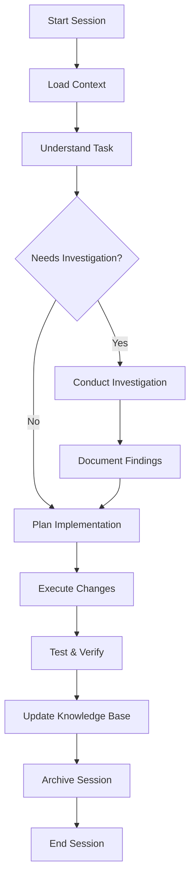

# Bwaincell - Trinity Method Guide

**Version:** 1.0.1
**Deployed:** 2025-10-03T20:07:27.933Z
**Project:** Discord.js Bot - Personal Server Management Utility

---

## What is Trinity Method?

Trinity Method is an investigation-first development methodology that emphasizes:

- **Understanding before implementing** - Deep investigation precedes all code changes
- **Strategic planning over reactive coding** - Comprehensive planning prevents technical debt
- **Quality and maintainability from the start** - Built-in quality gates ensure excellence
- **Knowledge capture and reuse** - All discoveries documented for future reference

---

## Trinity Structure for Bwaincell

```
Bwaincell/
├── trinity/
│   ├── knowledge-base/           # Central knowledge repository
│   │   ├── ARCHITECTURE.md       # System architecture and technical decisions
│   │   ├── Trinity.md            # Trinity methodology guidelines
│   │   ├── To-do.md              # Task management and priorities
│   │   ├── ISSUES.md             # Known issues and patterns (INO maintains)
│   │   └── Technical-Debt.md     # Tech debt tracking and strategy
│   ├── sessions/                 # Session archives (timestamped)
│   │   └── YYYY-MM-DD-HHMMSS/    # Individual session records
│   ├── investigations/           # Investigation work products
│   │   └── [topic-name]/         # Investigation artifacts
│   ├── patterns/                 # Reusable solution patterns
│   │   └── [pattern-name].md     # Documented patterns
│   └── work-orders/              # Active work orders
│       └── WORKORDER-XXX.md      # Structured work plans
├── .claude/
│   └── agents/                   # AI agent configurations
│       ├── aly.md                # CTO - Strategic planning
│       ├── aj.md                 # Implementation Lead
│       ├── tan.md                # Structure Specialist
│       ├── zen.md                # Knowledge Specialist
│       ├── ino.md                # Context Specialist (this agent)
│       ├── ein.md                # CI/CD Specialist
│       └── juno.md               # Quality Auditor
├── CLAUDE.md                     # Claude Code memory (project context)
└── TRINITY.md                    # This file
```

---

## Core Principles

### 1. Investigate First

**Never code before understanding.**

- Analyze the problem thoroughly
- Identify root causes, not symptoms
- Research existing solutions and patterns
- Document findings before implementation
- Time-box investigations (default: 2 hours)

### 2. Document Thoroughly

**Knowledge is a project asset.**

- Keep knowledge base current and accurate
- Document all architectural decisions
- Record patterns for reuse
- Maintain issue database with solutions
- Archive session learnings

### 3. Archive Sessions

**Progress tracking matters.**

- Every session archived in `trinity/sessions/`
- Session summaries capture key decisions
- Patterns extracted from sessions
- Continuity between sessions maintained
- Historical reference available

### 4. Quality Focus

**Maintainability over speed.**

- Code quality gates enforced
- Technical debt tracked and managed
- Pattern-based development
- Comprehensive testing required
- Regular audits conducted

---

## Starting a Session

### Initial Context Loading

When starting work with Trinity Method:

1. **Load Project Context**
   - Read `CLAUDE.md` for project overview
   - Review recent git history and changes
   - Check current branch and status

2. **Review Knowledge Base**
   - `trinity/knowledge-base/ARCHITECTURE.md` - System design
   - `trinity/knowledge-base/To-do.md` - Current tasks
   - `trinity/knowledge-base/ISSUES.md` - Known issues
   - `trinity/knowledge-base/Technical-Debt.md` - Debt status

3. **Understand Current State**
   - Check for uncommitted changes
   - Review recent commits
   - Assess system health
   - Identify blockers

### Session Workflow



---

## Trinity Agents

### Leadership Team

#### Aly - CTO (Strategic Planning)

**Command:** `/trinity-aly`

- Creates comprehensive work orders
- Strategic planning and prioritization
- Cross-team coordination
- High-level architecture decisions

#### AJ - Implementation Lead

**Command:** `/trinity-aj`

- Code execution and implementation
- Follows work orders from Aly
- Technical implementation decisions
- Code quality enforcement

### Deployment Team

#### TAN - Structure Specialist

**Command:** `/trinity-tan`

- Directory architecture and organization
- File structure maintenance
- Module organization
- Structural refactoring

#### ZEN - Knowledge Specialist

**Command:** `/trinity-zen`

- Documentation creation and maintenance
- Knowledge base curation
- Architecture documentation
- Trinity.md maintenance

#### INO - Context Specialist (This Agent)

**Command:** `/trinity-ino`

- **Establishes CLAUDE.md behavioral hierarchy**
- **Creates and maintains ISSUES.md database**
- **Analyzes codebase for issues and patterns**
- **Identifies framework-specific anti-patterns**
- Context building and analysis
- Issue cataloging and categorization

#### Ein - CI/CD Specialist

**Command:** `/trinity-ein`

- Continuous integration setup
- Deployment automation
- Pipeline configuration
- Build optimization

### Audit Team

#### JUNO - Quality Auditor

**Command:** `/trinity-juno`

- Comprehensive quality audits
- Compliance verification
- Technical debt assessment
- Best practices enforcement

---

## Bwaincell-Specific Guidelines

### Discord.js Development Patterns

#### Critical Interaction Handling

```typescript
// ALWAYS defer interactions immediately
if (interaction.isChatInputCommand()) {
  await interaction.deferReply();
  // Now you have 15 minutes to respond
}

// Check interaction state before responding
if (interaction.deferred) {
  await interaction.editReply(response);
} else if (!interaction.replied) {
  await interaction.reply(response);
}
```

#### Error Recovery

```typescript
// Handle Discord error codes
const errorCode = (error as any)?.code;
if (errorCode === 10062) {
  // Unknown interaction
  logger.warn('Interaction expired');
  return; // Don't attempt response
}
```

### Database Patterns

#### User Data Isolation

```typescript
// Always filter by user_id + guild_id
const tasks = await Task.findAll({
  where: {
    user_id: userId,
    guild_id: guildId,
  },
});
```

#### Transaction Safety

```typescript
// Use transactions for multi-step operations
const transaction = await sequelize.transaction();
try {
  await Model1.create(data1, { transaction });
  await Model2.update(data2, { transaction });
  await transaction.commit();
} catch (error) {
  await transaction.rollback();
  throw error;
}
```

### Type Safety Standards

#### Avoid `any` Types

```typescript
// Bad - loses type safety
const result: any = await someFunction();

// Good - maintain type safety
interface Result {
  id: number;
  data: string;
}
const result: Result = await someFunction();
```

---

## Investigation Protocol

### Starting an Investigation

1. **Define Scope**
   - What exactly needs investigation?
   - What are the success criteria?
   - What is the time limit?

2. **Gather Evidence**
   - Review existing code
   - Check logs and error messages
   - Examine database state
   - Search knowledge base for patterns

3. **Analyze Findings**
   - Identify root cause
   - Consider multiple solutions
   - Evaluate trade-offs
   - Document decision rationale

4. **Document Results**
   - Create investigation record in `trinity/investigations/`
   - Update ISSUES.md if issues found
   - Extract patterns to `trinity/patterns/`
   - Update ARCHITECTURE.md if architectural

### Investigation Time Boxing

| Investigation Type     | Default Time Limit |
| ---------------------- | ------------------ |
| Quick Research         | 30 minutes         |
| Standard Investigation | 2 hours            |
| Deep Dive              | 4 hours            |
| Architectural Analysis | 8 hours            |

---

## Issue Management

### Issue Lifecycle (INO Specialty)

1. **Discovered** - Issue identified in codebase
2. **Investigated** - Root cause analyzed
3. **Documented** - Added to ISSUES.md
4. **Prioritized** - Severity assigned (P0-P3)
5. **Resolved** - Fix implemented and tested
6. **Verified** - Solution confirmed working
7. **Pattern Extracted** - Reusable pattern documented
8. **Closed** - Knowledge captured and archived

### Issue Categories

- **P0 - Critical** - Blocking functionality or data loss
- **P1 - High** - Significant impact on user experience
- **P2 - Medium** - Quality issues affecting maintainability
- **P3 - Low** - Minor improvements and optimizations

---

## Knowledge Base Maintenance

### Regular Updates Required

| File              | Update Frequency            | Maintainer |
| ----------------- | --------------------------- | ---------- |
| CLAUDE.md         | After major changes         | INO        |
| ISSUES.md         | Every session               | INO        |
| ARCHITECTURE.md   | After architectural changes | ZEN        |
| Technical-Debt.md | Weekly                      | TAN        |
| To-do.md          | Daily                       | Aly        |
| Trinity.md        | Monthly                     | ZEN        |

---

## Session Archiving

### Session Archive Structure

```
trinity/sessions/2025-10-03-143022/
├── SESSION-SUMMARY.md         # Overview and accomplishments
├── investigation-summary.md   # Investigation findings
├── patterns-discovered.md     # New patterns identified
├── issues-resolved.md         # Problems solved
├── performance-report.md      # Metrics and benchmarks
└── next-session-plan.md       # Continuation planning
```

### Archive Contents

- All decisions made during session
- Code changes and rationale
- Issues discovered and resolved
- Patterns identified
- Performance metrics
- Next steps and blockers

---

## Quality Gates

### Pre-Commit Checklist

- [ ] Investigation completed and documented
- [ ] All tests passing
- [ ] Linter errors resolved
- [ ] Type safety maintained (no new `any` types)
- [ ] Performance standards met
- [ ] Error handling implemented
- [ ] Logging added for critical operations
- [ ] Documentation updated
- [ ] Knowledge base synchronized

### Pre-Merge Checklist

- [ ] All pre-commit checks passed
- [ ] Integration tests passing
- [ ] Code review completed
- [ ] ARCHITECTURE.md updated if needed
- [ ] ISSUES.md updated with fixes
- [ ] Technical debt documented
- [ ] Session archived

---

## Common Workflows

### Adding a New Feature

1. `/trinity-aly` - Create work order with requirements
2. `/trinity-ino` - Analyze context and identify patterns
3. `/trinity-aj` - Implement following work order
4. `/trinity-juno` - Audit implementation
5. Update knowledge base
6. Archive session

### Fixing a Bug

1. `/trinity-ino` - Investigate and document root cause
2. Update ISSUES.md with findings
3. `/trinity-aj` - Implement fix
4. Verify fix resolves issue
5. Extract pattern if applicable
6. Update knowledge base

### Refactoring Code

1. `/trinity-ino` - Analyze current implementation
2. `/trinity-aly` - Create refactoring work order
3. `/trinity-tan` - Plan structural changes
4. `/trinity-aj` - Execute refactoring
5. `/trinity-juno` - Verify quality improvement
6. Update Technical-Debt.md

---

## Getting Started with Trinity

### For New Team Members

1. Read this file (TRINITY.md)
2. Review CLAUDE.md for project context
3. Explore trinity/knowledge-base/ documentation
4. Review recent session archives
5. Check To-do.md for current priorities
6. Invoke `/trinity-ino` to understand current issues

### For Existing Development

1. Start session by loading context
2. Review current task in To-do.md
3. Invoke appropriate Trinity agent
4. Follow investigation-first approach
5. Document all findings
6. Archive session before ending

---

## Best Practices

### Do's

- Always investigate before implementing
- Document all architectural decisions
- Maintain knowledge base accuracy
- Extract reusable patterns
- Time-box investigations
- Archive every session
- Follow quality gates

### Don'ts

- Never code without understanding
- Don't skip documentation
- Avoid ad-hoc solutions without pattern analysis
- Don't ignore technical debt
- Never bypass quality gates
- Don't forget to archive sessions

---

## Bwaincell Project Context

### Current State (as of 2025-10-03)

**Version:** 1.0.0
**Status:** Active Development
**Recent Focus:** CI/CD patches, bot testing, legacy handler removal

### Technology Decisions

1. **Discord.js v14** - Latest stable version with slash command support
2. **TypeScript** - Type safety and better IDE support
3. **SQLite + Sequelize** - Simple, file-based persistence
4. **Winston Logger** - Structured logging with multiple transports
5. **Jest** - Comprehensive testing framework

### Known Challenges

1. **TypeScript Type Safety** - 150+ `any` types need refactoring
2. **Interaction Timing** - 3-second Discord window critical
3. **Module Alias Resolution** - Path aliases require careful configuration
4. **Test Coverage** - Needs expansion for all commands

---

## Support and Resources

### Documentation

- **Project Overview:** CLAUDE.md
- **Architecture:** trinity/knowledge-base/ARCHITECTURE.md
- **Issues:** trinity/knowledge-base/ISSUES.md
- **Technical Debt:** trinity/knowledge-base/Technical-Debt.md
- **Tasks:** trinity/knowledge-base/To-do.md

### Getting Help

- Check knowledge base first
- Review session archives for similar problems
- Search patterns library
- Invoke appropriate Trinity agent

---

## Trinity Method Benefits for Bwaincell

1. **Reduced Technical Debt** - Investigation prevents rushed solutions
2. **Knowledge Retention** - Session archives preserve context
3. **Pattern Reuse** - Documented patterns accelerate development
4. **Quality Assurance** - Built-in quality gates and audits
5. **Team Continuity** - Context maintained across sessions
6. **Issue Prevention** - Proactive issue identification

---

**Trinity Method SDK:** v1.0.1
**Deployed:** 2025-10-03T20:07:27.933Z
**Project:** Bwaincell Discord Bot

For detailed methodology information, see: [trinity/knowledge-base/Trinity.md](trinity/knowledge-base/Trinity.md)
