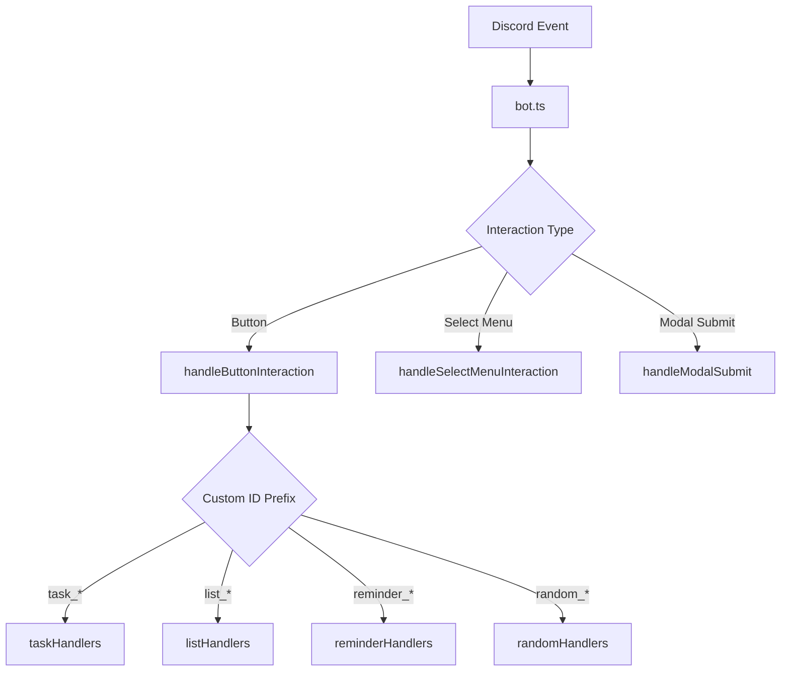

# Interaction Handler Architecture

## Overview

The interaction handler system provides a modular, maintainable architecture for managing all Discord user interactions in the Bwaincell bot. This system follows the Single Responsibility Principle, with each handler focusing on a specific domain (tasks, lists, reminders, etc.).

## Directory Structure

```
utils/interactions/
├── index.ts                      # Main router for all interactions
├── handlers/                     # Button and interaction handlers
│   ├── taskHandlers.ts          # Task management interactions
│   ├── listHandlers.ts          # List management interactions
│   ├── reminderHandlers.ts      # Reminder interactions
│   ├── randomHandlers.ts        # Entertainment feature interactions
│   └── selectMenuHandlers.ts    # Select menu interactions
├── modals/                       # Modal submission handlers
│   └── modalHandlers.ts         # All modal submissions
├── helpers/                      # Utility functions
│   └── databaseHelper.ts        # Database model loading
├── responses/                    # Response templates
│   ├── embedTemplates.ts        # Reusable embed templates
│   └── errorResponses.ts        # Error handling utilities
├── types/                        # TypeScript definitions
│   └── interactions.ts          # Interaction type definitions
└── middleware/                   # Middleware system (future)
    ├── authMiddleware.ts        # Permission checking
    ├── validationMiddleware.ts  # Input validation
    └── rateLimitMiddleware.ts   # Rate limiting
```

## Architecture Principles

### 1. Separation of Concerns

Each handler file manages a specific feature domain:

- **taskHandlers.ts**: All task-related interactions
- **listHandlers.ts**: List management operations
- **reminderHandlers.ts**: Reminder CRUD operations
- **randomHandlers.ts**: Entertainment features (movies, quotes, dinner)

### 2. Interaction Flow



### 3. Error Handling

All handlers implement consistent error handling:

- Errors are caught and logged
- User-friendly messages are displayed
- Bot stability is maintained

## Adding New Handlers

### Step 1: Create Handler File

Create a new file in `handlers/` directory:

```typescript
// handlers/newFeatureHandlers.ts
import { ButtonInteraction, CacheType } from 'discord.js';
import { handleInteractionError } from '../responses/errorResponses';

export async function handleNewFeatureButton(
  interaction: ButtonInteraction<CacheType>
): Promise<void> {
  const customId = interaction.customId;
  const userId = interaction.user.id;
  const guildId = interaction.guild?.id;

  if (!guildId) {
    await interaction.followUp({
      content: '❌ Server only command.',
      ephemeral: true,
    });
    return;
  }

  try {
    // Handle specific actions based on customId
    if (customId === 'newfeature_action') {
      // Implementation
    }
  } catch (error) {
    await handleInteractionError(interaction, error, 'new feature');
  }
}
```

### Step 2: Register in Router

Add to `index.ts`:

```typescript
import { handleNewFeatureButton } from './handlers/newFeatureHandlers';

// In handleButtonInteraction function:
if (customId.startsWith('newfeature_')) {
  await handleNewFeatureButton(interaction);
}
```

### Step 3: Add Types (if needed)

Define interfaces in `types/interactions.ts`:

```typescript
export interface NewFeatureData {
  id: string;
  // ... other properties
}
```

## Common Patterns

### Modal Creation Pattern

```typescript
const modal = new ModalBuilder().setCustomId('feature_modal').setTitle('Modal Title');

const input = new TextInputBuilder()
  .setCustomId('input_field')
  .setLabel('Field Label')
  .setStyle(TextInputStyle.Short)
  .setRequired(true);

const row = new ActionRowBuilder<TextInputBuilder>().addComponents(input);

modal.addComponents(row);
await interaction.showModal(modal);
```

### Database Operation Pattern

```typescript
const { ModelName } = await getModels();
const result = await ModelName.findOne({
  where: { user_id: userId, guild_id: guildId },
});
```

### Embed Response Pattern

```typescript
const embed = createSuccessEmbed('Title', 'Description');
const buttons = createActionButtons([
  { customId: 'action_1', label: 'Action 1' },
  { customId: 'action_2', label: 'Action 2' },
]);

await interaction.followUp({
  embeds: [embed],
  components: [buttons],
  ephemeral: true,
});
```

## Testing

### Running Tests

```bash
npm test                  # Run all tests
npm run test:watch       # Watch mode
npm run test:coverage    # Generate coverage report
```

### Test Structure

Tests are located in `tests/unit/handlers/`:

- Each handler has a corresponding test file
- Mocks are provided for Discord.js and database operations
- Focus on business logic and error handling

### Writing Tests

```typescript
describe('FeatureHandler', () => {
  it('should handle valid interaction', async () => {
    const interaction = createMockButtonInteraction('feature_action');
    await handleFeatureButton(interaction);
    expect(interaction.followUp).toHaveBeenCalledWith(
      expect.objectContaining({ content: expect.stringContaining('Success') })
    );
  });
});
```

## Performance Considerations

### Deferral Strategy

- Modal buttons: Never defer (modals can't be shown after deferring)
- Data operations: Defer immediately to prevent timeout
- Quick responses: No deferral needed

### Caching

Database models are cached after first load:

```typescript
let modelsCache: Models | null = null;
export async function getModels(): Promise<Models> {
  if (!modelsCache) {
    modelsCache = await loadModels();
  }
  return modelsCache;
}
```

## Security

### Input Validation

- All user inputs are validated before processing
- SQL injection prevention through Sequelize ORM
- XSS prevention through Discord.js sanitization

### Permission Checking

- Guild-only commands verify guild presence
- User-specific operations verify ownership
- Role-based permissions for admin commands

## Debugging

### Logging

All interactions are logged with contextual information:

```typescript
logger.info('Button interaction', {
  customId,
  userId,
  guildId,
  action: 'task_complete',
});
```

### Common Issues

1. **Interaction Already Replied**
   - Solution: Check `interaction.replied` and `interaction.deferred`
   - Use `followUp` instead of `reply` when appropriate

2. **Modal After Defer**
   - Solution: Never defer interactions that show modals
   - Check `isModalButton` flag before deferring

3. **Database Connection**
   - Solution: Ensure models are loaded with `getModels()`
   - Check database file permissions

## Future Enhancements

### Middleware System

Planned middleware for v2.0:

- Authentication middleware
- Rate limiting middleware
- Validation middleware
- Logging middleware

### Command Builders

Declarative command registration:

```typescript
@InteractionHandler('task_*')
class TaskHandler {
  @ButtonHandler('task_done_:id')
  async completeTask(interaction: ButtonInteraction, id: string) {
    // Implementation
  }
}
```

## Contributing

1. Follow existing patterns and conventions
2. Add comprehensive tests for new handlers
3. Update this documentation for new features
4. Ensure TypeScript compilation passes
5. Run linter before committing

## Support

For issues or questions about the interaction system:

1. Check the error logs in `logs/` directory
2. Review this documentation
3. Check existing handler implementations
4. Contact the development team

---

Last Updated: 2025-09-24
Version: 2.0.0
