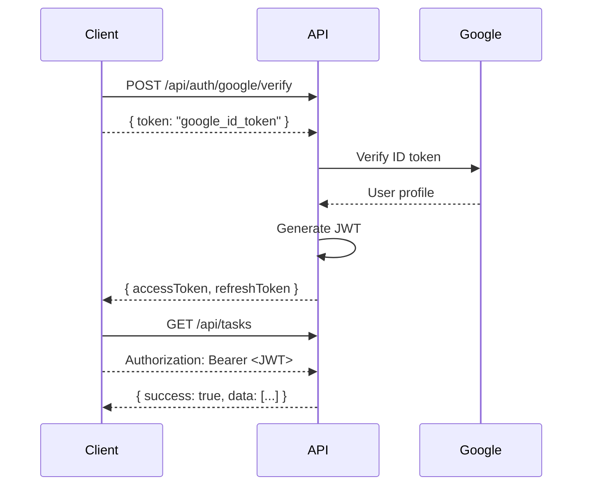

# Bwaincell REST API Documentation

The Bwaincell REST API provides secure, authenticated access to all productivity features via HTTP endpoints. This API powers the Progressive Web App (PWA) frontend and can be used by any client application.

---

## Base URLs

| Environment     | URL                         |
| --------------- | --------------------------- |
| **Production**  | `https://bwaincell.fly.dev` |
| **Development** | `http://localhost:3000`     |

---

## Authentication

All API endpoints (except `/health` and `/api/auth/*`) require JWT authentication.

### Authentication Flow



### Authentication Steps

1. **User authenticates with Google OAuth** (handled by frontend)
2. **Frontend sends Google ID token** to `/api/auth/google/verify`
3. **Backend verifies token** and returns JWT access token (1 hour expiry)
4. **Frontend includes JWT** in `Authorization` header for subsequent requests

### Request Headers

All authenticated requests must include:

```http
Authorization: Bearer <JWT_TOKEN>
Content-Type: application/json
```

---

## Response Format

All API responses follow a standardized format:

### Success Response

```json
{
  "success": true,
  "data": {
    // Response data
  }
}
```

### Error Response

```json
{
  "success": false,
  "error": {
    "code": "ERROR_CODE",
    "message": "Human-readable error message"
  }
}
```

---

## Authentication Endpoints

### Verify Google Token

Exchanges Google OAuth ID token for JWT access token.

**Endpoint:** `POST /api/auth/google/verify`

**Request:**

```json
{
  "token": "google_id_token_from_oauth_flow"
}
```

**Response:**

```json
{
  "success": true,
  "data": {
    "accessToken": "eyJhbGciOiJIUzI1NiIsInR5cCI6IkpXVCJ9...",
    "refreshToken": "eyJhbGciOiJIUzI1NiIsInR5cCI6IkpXVCJ9...",
    "expiresIn": 3600
  }
}
```

**Error Responses:**

- `401 Unauthorized` - Invalid or expired Google token
- `403 Forbidden` - Email not whitelisted

---

### Refresh Access Token

Exchanges refresh token for new access token.

**Endpoint:** `POST /api/auth/refresh`

**Request:**

```json
{
  "refreshToken": "eyJhbGciOiJIUzI1NiIsInR5cCI6IkpXVCJ9..."
}
```

**Response:**

```json
{
  "success": true,
  "data": {
    "accessToken": "eyJhbGciOiJIUzI1NiIsInR5cCI6IkpXVCJ9...",
    "expiresIn": 3600
  }
}
```

---

### Logout

Invalidates refresh token (access token expires naturally).

**Endpoint:** `POST /api/auth/logout`

**Headers:** `Authorization: Bearer <JWT_TOKEN>`

**Response:**

```json
{
  "success": true,
  "message": "Logged out successfully"
}
```

---

## Tasks API

Manage tasks with due dates and completion tracking.

### List All Tasks

**Endpoint:** `GET /api/tasks`

**Headers:** `Authorization: Bearer <JWT_TOKEN>`

**Response:**

```json
{
  "success": true,
  "data": [
    {
      "id": 1,
      "text": "Buy groceries",
      "completed": false,
      "dueDate": "2026-01-15",
      "createdAt": "2026-01-09T12:00:00Z",
      "updatedAt": "2026-01-09T12:00:00Z"
    }
  ]
}
```

---

### Get Single Task

**Endpoint:** `GET /api/tasks/:id`

**Headers:** `Authorization: Bearer <JWT_TOKEN>`

**Response:**

```json
{
  "success": true,
  "data": {
    "id": 1,
    "text": "Buy groceries",
    "completed": false,
    "dueDate": "2026-01-15",
    "createdAt": "2026-01-09T12:00:00Z",
    "updatedAt": "2026-01-09T12:00:00Z"
  }
}
```

---

### Create Task

**Endpoint:** `POST /api/tasks`

**Headers:** `Authorization: Bearer <JWT_TOKEN>`

**Request:**

```json
{
  "text": "Buy groceries",
  "dueDate": "2026-01-15"
}
```

**Response:**

```json
{
  "success": true,
  "data": {
    "id": 1,
    "text": "Buy groceries",
    "completed": false,
    "dueDate": "2026-01-15",
    "createdAt": "2026-01-09T12:00:00Z",
    "updatedAt": "2026-01-09T12:00:00Z"
  }
}
```

**Validation:**

- `text` (required, string, 1-500 characters)
- `dueDate` (optional, string, YYYY-MM-DD format)

---

### Update Task

**Endpoint:** `PATCH /api/tasks/:id`

**Headers:** `Authorization: Bearer <JWT_TOKEN>`

**Request:**

```json
{
  "text": "Buy groceries and cook dinner",
  "completed": true,
  "dueDate": "2026-01-16"
}
```

**Response:**

```json
{
  "success": true,
  "data": {
    "id": 1,
    "text": "Buy groceries and cook dinner",
    "completed": true,
    "dueDate": "2026-01-16",
    "createdAt": "2026-01-09T12:00:00Z",
    "updatedAt": "2026-01-09T14:00:00Z"
  }
}
```

---

### Delete Task

**Endpoint:** `DELETE /api/tasks/:id`

**Headers:** `Authorization: Bearer <JWT_TOKEN>`

**Response:**

```json
{
  "success": true,
  "message": "Task deleted successfully"
}
```

---

## Lists API

Create and manage named lists with completion tracking.

### List All Lists

**Endpoint:** `GET /api/lists`

**Headers:** `Authorization: Bearer <JWT_TOKEN>`

**Response:**

```json
{
  "success": true,
  "data": [
    {
      "name": "Groceries",
      "itemCount": 5,
      "createdAt": "2026-01-09T12:00:00Z"
    },
    {
      "name": "Travel Packing",
      "itemCount": 12,
      "createdAt": "2026-01-08T10:00:00Z"
    }
  ]
}
```

---

### Get List with Items

**Endpoint:** `GET /api/lists/:name`

**Headers:** `Authorization: Bearer <JWT_TOKEN>`

**Response:**

```json
{
  "success": true,
  "data": {
    "name": "Groceries",
    "items": [
      {
        "text": "Milk",
        "completed": false
      },
      {
        "text": "Eggs",
        "completed": true
      },
      {
        "text": "Bread",
        "completed": false
      }
    ],
    "createdAt": "2026-01-09T12:00:00Z"
  }
}
```

---

### Create List

**Endpoint:** `POST /api/lists`

**Headers:** `Authorization: Bearer <JWT_TOKEN>`

**Request:**

```json
{
  "name": "Groceries"
}
```

**Response:**

```json
{
  "success": true,
  "data": {
    "name": "Groceries",
    "items": [],
    "createdAt": "2026-01-09T12:00:00Z"
  }
}
```

**Validation:**

- `name` (required, string, 1-100 characters)

---

### Add Item to List

**Endpoint:** `POST /api/lists/:name/items`

**Headers:** `Authorization: Bearer <JWT_TOKEN>`

**Request:**

```json
{
  "itemText": "Milk"
}
```

**Response:**

```json
{
  "success": true,
  "data": {
    "name": "Groceries",
    "items": [
      {
        "text": "Milk",
        "completed": false
      }
    ]
  }
}
```

---

### Toggle Item Completion

**Endpoint:** `PATCH /api/lists/:name/items/:itemText/toggle`

**Headers:** `Authorization: Bearer <JWT_TOKEN>`

**Response:**

```json
{
  "success": true,
  "data": {
    "name": "Groceries",
    "items": [
      {
        "text": "Milk",
        "completed": true
      }
    ]
  }
}
```

---

### Remove Item from List

**Endpoint:** `DELETE /api/lists/:name/items/:itemText`

**Headers:** `Authorization: Bearer <JWT_TOKEN>`

**Response:**

```json
{
  "success": true,
  "message": "Item removed successfully"
}
```

---

### Delete List

**Endpoint:** `DELETE /api/lists/:name`

**Headers:** `Authorization: Bearer <JWT_TOKEN>`

**Response:**

```json
{
  "success": true,
  "message": "List deleted successfully"
}
```

---

## Notes API

Create searchable notes with tag support.

### List All Notes

**Endpoint:** `GET /api/notes`

**Headers:** `Authorization: Bearer <JWT_TOKEN>`

**Response:**

```json
{
  "success": true,
  "data": [
    {
      "id": 1,
      "content": "Meeting notes from Jan 9",
      "tags": "work,meeting",
      "createdAt": "2026-01-09T12:00:00Z",
      "updatedAt": "2026-01-09T12:00:00Z"
    }
  ]
}
```

---

### Search Notes

**Endpoint:** `GET /api/notes?search=meeting`

**Headers:** `Authorization: Bearer <JWT_TOKEN>`

**Query Parameters:**

- `search` (string) - Search keyword in content and tags

**Response:**

```json
{
  "success": true,
  "data": [
    {
      "id": 1,
      "content": "Meeting notes from Jan 9",
      "tags": "work,meeting",
      "createdAt": "2026-01-09T12:00:00Z"
    }
  ]
}
```

---

### Get Note

**Endpoint:** `GET /api/notes/:id`

**Headers:** `Authorization: Bearer <JWT_TOKEN>`

**Response:**

```json
{
  "success": true,
  "data": {
    "id": 1,
    "content": "Meeting notes from Jan 9",
    "tags": "work,meeting",
    "createdAt": "2026-01-09T12:00:00Z",
    "updatedAt": "2026-01-09T12:00:00Z"
  }
}
```

---

### Create Note

**Endpoint:** `POST /api/notes`

**Headers:** `Authorization: Bearer <JWT_TOKEN>`

**Request:**

```json
{
  "content": "Meeting notes from Jan 9",
  "tags": "work,meeting"
}
```

**Response:**

```json
{
  "success": true,
  "data": {
    "id": 1,
    "content": "Meeting notes from Jan 9",
    "tags": "work,meeting",
    "createdAt": "2026-01-09T12:00:00Z",
    "updatedAt": "2026-01-09T12:00:00Z"
  }
}
```

**Validation:**

- `content` (required, string, 1-5000 characters)
- `tags` (optional, string, comma-separated tags)

---

### Update Note

**Endpoint:** `PATCH /api/notes/:id`

**Headers:** `Authorization: Bearer <JWT_TOKEN>`

**Request:**

```json
{
  "content": "Updated meeting notes",
  "tags": "work,meeting,important"
}
```

**Response:**

```json
{
  "success": true,
  "data": {
    "id": 1,
    "content": "Updated meeting notes",
    "tags": "work,meeting,important",
    "createdAt": "2026-01-09T12:00:00Z",
    "updatedAt": "2026-01-09T14:00:00Z"
  }
}
```

---

### Delete Note

**Endpoint:** `DELETE /api/notes/:id`

**Headers:** `Authorization: Bearer <JWT_TOKEN>`

**Response:**

```json
{
  "success": true,
  "message": "Note deleted successfully"
}
```

---

## Reminders API

Schedule one-time, daily, or weekly reminders.

### List All Reminders

**Endpoint:** `GET /api/reminders`

**Headers:** `Authorization: Bearer <JWT_TOKEN>`

**Response:**

```json
{
  "success": true,
  "data": [
    {
      "id": 1,
      "message": "Take medication",
      "time": "09:00",
      "frequency": "daily",
      "dayOfWeek": null,
      "createdAt": "2026-01-09T12:00:00Z"
    },
    {
      "id": 2,
      "message": "Team meeting",
      "time": "14:00",
      "frequency": "weekly",
      "dayOfWeek": 1,
      "createdAt": "2026-01-09T12:00:00Z"
    }
  ]
}
```

---

### Get Reminder

**Endpoint:** `GET /api/reminders/:id`

**Headers:** `Authorization: Bearer <JWT_TOKEN>`

**Response:**

```json
{
  "success": true,
  "data": {
    "id": 1,
    "message": "Take medication",
    "time": "09:00",
    "frequency": "daily",
    "dayOfWeek": null,
    "createdAt": "2026-01-09T12:00:00Z"
  }
}
```

---

### Create Reminder

**Endpoint:** `POST /api/reminders`

**Headers:** `Authorization: Bearer <JWT_TOKEN>`

**Request (Daily):**

```json
{
  "message": "Take medication",
  "time": "09:00",
  "frequency": "daily"
}
```

**Request (Weekly):**

```json
{
  "message": "Team meeting",
  "time": "14:00",
  "frequency": "weekly",
  "dayOfWeek": 1
}
```

**Response:**

```json
{
  "success": true,
  "data": {
    "id": 1,
    "message": "Take medication",
    "time": "09:00",
    "frequency": "daily",
    "dayOfWeek": null,
    "createdAt": "2026-01-09T12:00:00Z"
  }
}
```

**Validation:**

- `message` (required, string, 1-500 characters)
- `time` (required, string, HH:MM format)
- `frequency` (required, enum: `once`, `daily`, `weekly`)
- `dayOfWeek` (required for weekly, integer 0-6, 0=Sunday)

---

### Delete Reminder

**Endpoint:** `DELETE /api/reminders/:id`

**Headers:** `Authorization: Bearer <JWT_TOKEN>`

**Response:**

```json
{
  "success": true,
  "message": "Reminder deleted successfully"
}
```

---

## Budget API

Track income and expenses with category-based organization.

### List All Transactions

**Endpoint:** `GET /api/budget/transactions`

**Headers:** `Authorization: Bearer <JWT_TOKEN>`

**Response:**

```json
{
  "success": true,
  "data": [
    {
      "id": 1,
      "amount": 50.0,
      "category": "groceries",
      "description": "Weekly shopping",
      "type": "expense",
      "createdAt": "2026-01-09T12:00:00Z"
    },
    {
      "id": 2,
      "amount": 3000.0,
      "category": "salary",
      "description": "January paycheck",
      "type": "income",
      "createdAt": "2026-01-01T00:00:00Z"
    }
  ]
}
```

---

### Get Budget Summary

**Endpoint:** `GET /api/budget/summary?month=2026-01`

**Headers:** `Authorization: Bearer <JWT_TOKEN>`

**Query Parameters:**

- `month` (optional, string, YYYY-MM format, defaults to current month)

**Response:**

```json
{
  "success": true,
  "data": {
    "month": "2026-01",
    "totalIncome": 3000.0,
    "totalExpenses": 1500.0,
    "balance": 1500.0,
    "categories": {
      "groceries": 300.0,
      "utilities": 200.0,
      "entertainment": 150.0,
      "transportation": 250.0
    }
  }
}
```

---

### Create Transaction

**Endpoint:** `POST /api/budget/transactions`

**Headers:** `Authorization: Bearer <JWT_TOKEN>`

**Request:**

```json
{
  "amount": 50.0,
  "category": "groceries",
  "description": "Weekly shopping",
  "type": "expense"
}
```

**Response:**

```json
{
  "success": true,
  "data": {
    "id": 1,
    "amount": 50.0,
    "category": "groceries",
    "description": "Weekly shopping",
    "type": "expense",
    "createdAt": "2026-01-09T12:00:00Z"
  }
}
```

**Validation:**

- `amount` (required, number, positive value)
- `category` (required, string, 1-50 characters)
- `description` (optional, string, max 500 characters)
- `type` (required, enum: `expense`, `income`)

---

### Delete Transaction

**Endpoint:** `DELETE /api/budget/transactions/:id`

**Headers:** `Authorization: Bearer <JWT_TOKEN>`

**Response:**

```json
{
  "success": true,
  "message": "Transaction deleted successfully"
}
```

---

## Health Check

### Server Health

**Endpoint:** `GET /health`

**No authentication required**

**Response:**

```json
{
  "status": "ok",
  "timestamp": "2026-01-09T12:00:00Z"
}
```

---

## Error Codes

| Code               | Status | Description                             |
| ------------------ | ------ | --------------------------------------- |
| `VALIDATION_ERROR` | 400    | Request validation failed               |
| `UNAUTHORIZED`     | 401    | Missing or invalid authentication token |
| `FORBIDDEN`        | 403    | Insufficient permissions                |
| `NOT_FOUND`        | 404    | Resource not found                      |
| `CONFLICT`         | 409    | Resource already exists                 |
| `INTERNAL_ERROR`   | 500    | Internal server error                   |

---

## Rate Limiting

- **Limit:** 100 requests per minute per IP address
- **Header:** `X-RateLimit-Remaining` shows remaining requests
- **Exceeded:** Returns `429 Too Many Requests`

---

## CORS Configuration

Allowed origins:

- `https://bwain-app.vercel.app`
- `http://localhost:3000`
- `http://localhost:3001`

Allowed headers:

- `Content-Type`
- `Authorization`

---

## Examples

### cURL Examples

```bash
# Get tasks
curl -H "Authorization: Bearer YOUR_JWT_TOKEN" \
  https://bwaincell.fly.dev/api/tasks

# Create task
curl -X POST \
  -H "Authorization: Bearer YOUR_JWT_TOKEN" \
  -H "Content-Type: application/json" \
  -d '{"text":"Buy groceries","dueDate":"2026-01-15"}' \
  https://bwaincell.fly.dev/api/tasks

# Update task
curl -X PATCH \
  -H "Authorization: Bearer YOUR_JWT_TOKEN" \
  -H "Content-Type: application/json" \
  -d '{"completed":true}' \
  https://bwaincell.fly.dev/api/tasks/1

# Delete task
curl -X DELETE \
  -H "Authorization: Bearer YOUR_JWT_TOKEN" \
  https://bwaincell.fly.dev/api/tasks/1
```

### JavaScript/Fetch Examples

```javascript
// Authenticate
const authResponse = await fetch('https://bwaincell.fly.dev/api/auth/google/verify', {
  method: 'POST',
  headers: { 'Content-Type': 'application/json' },
  body: JSON.stringify({ token: googleIdToken }),
});
const {
  data: { accessToken },
} = await authResponse.json();

// Get tasks
const tasksResponse = await fetch('https://bwaincell.fly.dev/api/tasks', {
  headers: { Authorization: `Bearer ${accessToken}` },
});
const { data: tasks } = await tasksResponse.json();

// Create task
const createResponse = await fetch('https://bwaincell.fly.dev/api/tasks', {
  method: 'POST',
  headers: {
    Authorization: `Bearer ${accessToken}`,
    'Content-Type': 'application/json',
  },
  body: JSON.stringify({
    text: 'Buy groceries',
    dueDate: '2026-01-15',
  }),
});
const { data: newTask } = await createResponse.json();
```

---

## Additional Resources

- **Getting Started Guide:** [docs/guides/getting-started.md](../guides/getting-started.md)
- **Discord Commands Reference:** [docs/reference/discord-commands.md](../reference/discord-commands.md)
- **Architecture Overview:** [docs/architecture/overview.md](../architecture/overview.md)
- **Deployment Guide:** [docs/guides/deployment.md](../guides/deployment.md)

---

**Last Updated:** 2026-01-09
**API Version:** 1.0.0
