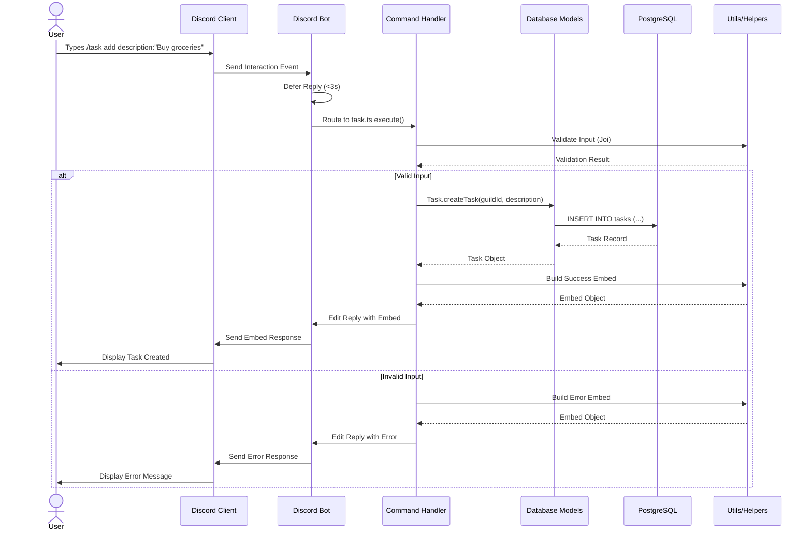
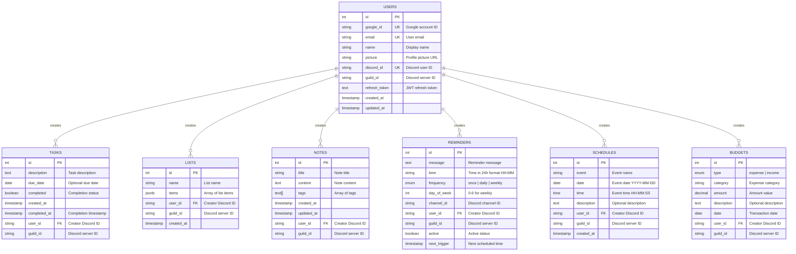
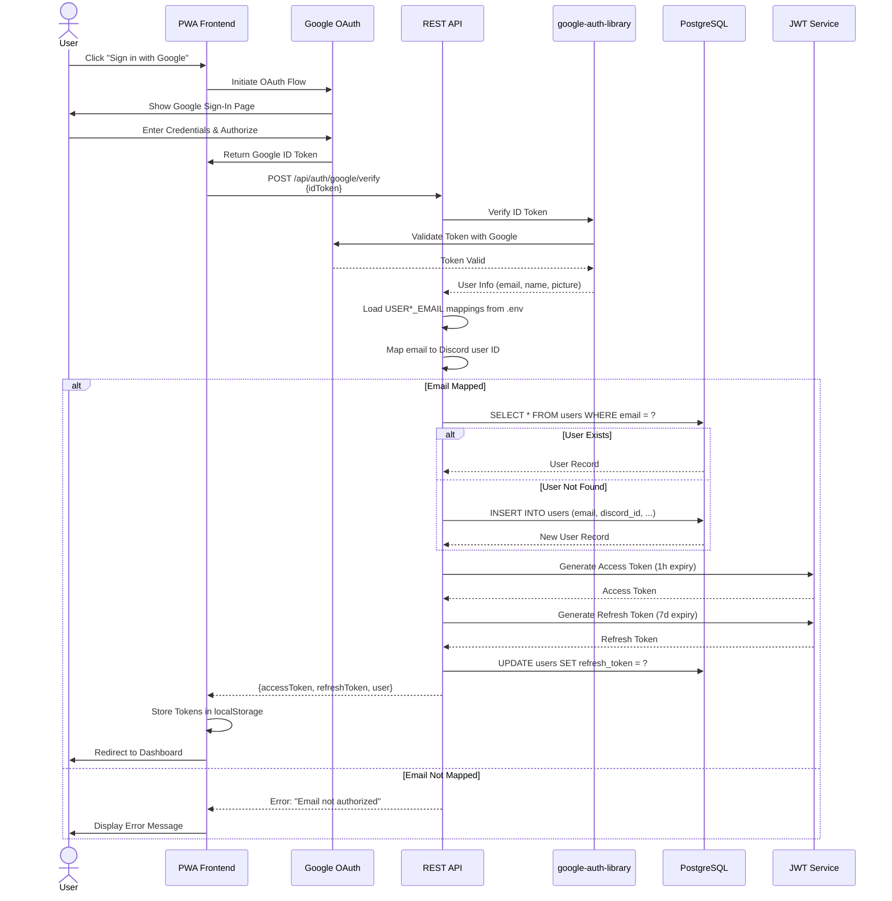
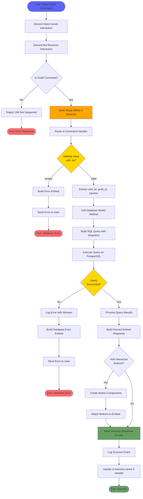
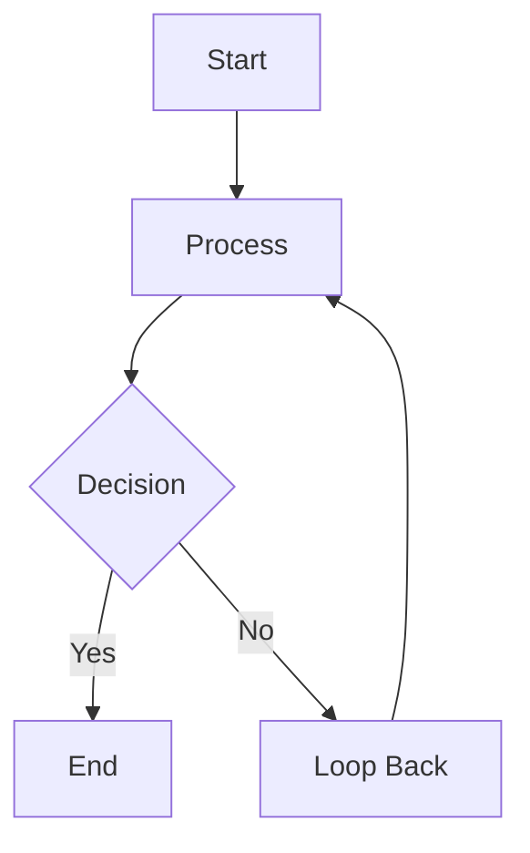

# Architecture Diagrams

**Version:** 2.0.0
**Last Updated** 2026-01-12

Visual documentation of Bwaincell system architecture, component interactions, database relationships, authentication flow, deployment architecture, and data flow using Mermaid diagrams.

---

## Table of Contents

1. [System Architecture Diagram](#1-system-architecture-diagram)
2. [Component Interaction Diagram](#2-component-interaction-diagram)
3. [Database ER Diagram](#3-database-er-diagram)
4. [Authentication Flow Diagram](#4-authentication-flow-diagram)
5. [Deployment Architecture Diagram](#5-deployment-architecture-diagram)
6. [Data Flow Diagram](#6-data-flow-diagram)
7. [How to Create Diagrams](#how-to-create-diagrams)

---

## 1. System Architecture Diagram

High-level overview of Bwaincell's three-interface architecture showing Discord Bot, REST API, Progressive Web App, and PostgreSQL database.

```mermaid
graph TB
    subgraph "Client Layer"
        Discord[Discord Client]
        Browser[Web Browser]
        Mobile[Mobile Device]
    end

    subgraph "Application Layer"
        DiscordBot["Discord Bot<br/>(Discord.js 14)"]
        RestAPI["REST API<br/>(Express 4.21)"]
        PWA["Progressive Web App<br/>(Next.js 14.2)"]
    end

    subgraph "Data Layer"
        PostgreSQL["PostgreSQL 15<br/>(Sequelize ORM)"]
    end

    subgraph "External Services"
        DiscordAPI[Discord API]
        GoogleOAuth[Google OAuth 2.0]
    end

    Discord -->|Slash Commands| DiscordBot
    Browser -->|HTTPS| PWA
    Mobile -->|HTTPS| PWA

    DiscordBot -->|Events/Messages| DiscordAPI
    DiscordAPI -->|Interactions| DiscordBot

    PWA -->|HTTP Requests<br/>JWT Auth| RestAPI
    DiscordBot -->|SQL Queries| PostgreSQL
    RestAPI -->|SQL Queries| PostgreSQL

    RestAPI -->|Verify ID Token| GoogleOAuth
    PWA -->|OAuth Flow| GoogleOAuth
    GoogleOAuth -->|ID Token| PWA

    style DiscordBot fill:#5865F2
    style RestAPI fill:#68A063
    style PWA fill:#000000
    style PostgreSQL fill:#336791
    style DiscordAPI fill:#5865F2
    style GoogleOAuth fill:#4285F4
```



**Key Components:**

- **Discord Bot:** Primary interface via Discord slash commands
- **REST API:** Express-based HTTP API with JWT authentication
- **PWA:** Next.js frontend with offline support
- **PostgreSQL:** Production-grade relational database
- **Discord API:** External service for Discord integration
- **Google OAuth:** External authentication provider

**Related:** [Architecture Overview](overview.md) | [Getting Started](../guides/getting-started.md)

---

## 2. Component Interaction Diagram

Detailed flow showing how Discord commands are processed through the system from user interaction to database response.



**Flow Steps:**

1. User types slash command in Discord
2. Discord sends interaction event to bot
3. Bot immediately defers reply (within 3 seconds)
4. Bot routes interaction to appropriate command handler
5. Command validates input with Joi schemas
6. Command calls database model methods
7. Model executes SQL query via Sequelize ORM
8. Model returns data to command handler
9. Command builds Discord embed response
10. Bot sends final response to Discord
11. Discord displays response to user

**Related:** [Discord Commands](../api/discord-commands.md) | [Database Schema](database-schema.md)

---

## 3. Database ER Diagram

Entity-Relationship diagram showing all 6 core tables with their fields, data types, and relationships.



**Key Design Decisions:**

- **No Foreign Key Constraints:** Simplified schema for easier migration and flexibility
- **Guild-Based Isolation:** All tables filter by `guild_id` for shared household model
- **User ID for Audit:** `user_id` stored for audit trail but not enforced in queries
- **JSONB for Lists:** Flexible item storage using PostgreSQL JSONB type
- **Array Types for Tags:** PostgreSQL native array type for note tags

**Relationships:**

- Users → Tasks: One-to-Many
- Users → Lists: One-to-Many
- Users → Notes: One-to-Many
- Users → Reminders: One-to-Many
- Users → Schedules: One-to-Many
- Users → Budgets: One-to-Many

**Related:** [Database Schema](database-schema.md) | [API Documentation](../api/)

---

## 4. Authentication Flow Diagram

Sequence diagram showing Google OAuth 2.0 authentication flow with JWT token generation and user-Discord ID mapping.



**Authentication Steps:**

1. User initiates Google OAuth flow
2. Google authenticates user and returns ID token
3. PWA sends ID token to backend for verification
4. Backend verifies token with google-auth-library
5. Backend maps Google email to Discord user ID (from .env)
6. Backend creates or retrieves user record from database
7. Backend generates JWT access token (1 hour expiry)
8. Backend generates JWT refresh token (7 days expiry)
9. Backend stores refresh token in database
10. Backend returns tokens + user info to frontend
11. Frontend stores tokens and redirects to dashboard

**Security Considerations:**

- ID token verified with Google on every login
- Email whitelist enforced via environment variables
- JWT tokens signed with HS256 algorithm
- Refresh tokens stored in database for revocation
- Access tokens short-lived (1 hour)

**Related:** [API Documentation - Authentication](../api/README.md#authentication) | [Troubleshooting - OAuth Issues](../guides/troubleshooting.md#issue-32-google-oauth-verification-failed)

---

## 5. Deployment Architecture Diagram

Infrastructure diagram showing production deployment on Raspberry Pi 4B with Docker Compose, PostgreSQL, and Vercel frontend.

```mermaid
graph TB
    subgraph "User Devices"
        DiscordClient[Discord Desktop/Mobile]
        WebBrowser[Web Browser]
        MobileDevice[Mobile Device PWA]
    end

    subgraph "Raspberry Pi 4B - Local Network"
        direction TB

        subgraph "Docker Compose Stack"
            direction LR
            Backend["Backend Container<br/>bwaincell-backend<br/>Port 3000<br/>512MB RAM<br/>Node.js 18"]
            Postgres["PostgreSQL Container<br/>bwaincell-db<br/>Port 5433<br/>512MB RAM<br/>PostgreSQL 15"]
        end

        Logs["/logs Volume<br/>Winston Logs<br/>Max 75MB"]
        Data["/postgres-data Volume<br/>Database Storage<br/>Persistent"]

        Backend -.->|Write| Logs
        Postgres -.->|Store| Data
        Backend -->|SQL Queries| Postgres
    end

    subgraph "Vercel Serverless - Global CDN"
        Frontend["Next.js PWA<br/>Serverless Functions<br/>Static Assets<br/>Auto-Scaling"]
    end

    subgraph "External Services"
        DiscordAPI[Discord API<br/>Gateway & REST]
        GoogleAuth[Google OAuth 2.0<br/>Authentication]
    end

    subgraph "Deployment Pipeline"
        GitHub[GitHub Repository<br/>Main Branch]
        Actions[GitHub Actions<br/>Auto-Deploy]
    end

    DiscordClient -->|WebSocket| DiscordAPI
    DiscordAPI -->|Events| Backend

    WebBrowser -->|HTTPS| Frontend
    MobileDevice -->|HTTPS| Frontend

    Frontend -->|HTTPS/JWT| Backend
    Frontend -->|OAuth| GoogleAuth
    Backend -->|Verify| GoogleAuth

    GitHub -->|Push to Main| Actions
    Actions -->|SSH Deploy| Backend
    Actions -->|Deploy| Frontend

    style Backend fill:#68A063
    style Postgres fill:#336791
    style Frontend fill:#000000
    style DiscordAPI fill:#5865F2
    style GoogleAuth fill:#4285F4
    style GitHub fill:#181717
```



**Deployment Details:**

**Raspberry Pi 4B (Backend + Database):**

- OS: Raspberry Pi OS 64-bit
- Docker: Backend + PostgreSQL containers
- Network: Local network (192.168.x.x)
- Resource Limits: 512MB RAM per container
- Volumes: Logs (/logs), Database (/postgres-data)
- Health Checks: Every 30 seconds

**Vercel (Frontend):**

- Platform: Vercel serverless
- Framework: Next.js 14.2+ with App Router
- Deployment: Auto-deploy on push to main
- CDN: Global edge network
- SSL: Automatic HTTPS certificates

**GitHub Actions (CI/CD):**

- Trigger: Push to main branch
- Backend: SSH into Pi, pull code, rebuild Docker image, restart containers
- Frontend: Automatic Vercel deployment

**Related:** [docker-compose.yml](../../docker-compose.yml) | [Getting Started - Deployment](../guides/getting-started.md)

---

## 6. Data Flow Diagram

Flowchart showing how user actions flow through Discord command → Backend → Database → Response for the complete request-response cycle.



**Data Flow Steps:**

1. **User Interaction:** User types slash command in Discord
2. **Discord Gateway:** Discord sends interaction event to bot
3. **Guild Check:** Bot verifies command was sent in guild (not DM)
4. **Immediate Deferral:** Bot defers reply within 3 seconds to prevent timeout
5. **Command Routing:** Bot routes interaction to appropriate command handler
6. **Input Validation:** Command validates parameters with Joi schemas
7. **Data Extraction:** Command extracts user_id, guild_id, and parameters
8. **Model Call:** Command calls database model method
9. **Query Building:** Sequelize builds parameterized SQL query
10. **Query Execution:** PostgreSQL executes query with guild_id filtering
11. **Result Processing:** Model processes database results into objects
12. **Response Building:** Command builds Discord embed with results
13. **Interactive Components:** Optionally add buttons for quick actions
14. **Send Response:** Bot sends final response to Discord
15. **Logging:** Winston logs success/error with context
16. **Cache Update:** Update in-memory cache if needed (e.g., reminder scheduler)

**Error Handling:**

- **Validation Errors:** Return user-friendly error message
- **Database Errors:** Log full error, return generic message to user
- **Timeout Errors:** Prevented by immediate deferral

**Related:** [Discord Commands](../api/discord-commands.md) | [Database Schema](database-schema.md) | [Troubleshooting](../guides/troubleshooting.md)

---

## How to Create Diagrams

### Mermaid Syntax Guide

Bwaincell documentation uses Mermaid for all diagrams. Mermaid is a text-based diagramming tool that renders in markdown.

**Basic Syntax:**

````markdown

````

````

**Diagram Types:**

| Type | Code | Use Case |
|------|------|----------|
| **Flowchart** | `flowchart TD` or `graph TD` | Process flows, decision trees |
| **Sequence** | `sequenceDiagram` | Interactions between components |
| **ER Diagram** | `erDiagram` | Database relationships |
| **Class Diagram** | `classDiagram` | Object-oriented design |
| **State Diagram** | `stateDiagram-v2` | State machines |
| **Gantt Chart** | `gantt` | Project timelines |

**Flowchart Directions:**
- `TD` or `TB` - Top to Bottom
- `BT` - Bottom to Top
- `LR` - Left to Right
- `RL` - Right to Left

**Node Shapes:**
- `[Text]` - Rectangle
- `(Text)` - Rounded rectangle
- `{Text}` - Diamond (decision)
- `([Text])` - Stadium (start/end)
- `[[Text]]` - Subroutine
- `[(Text)]` - Cylinder (database)

**Arrows:**
- `-->` - Solid arrow
- `-.->` - Dotted arrow
- `==>` - Thick arrow
- `--Text-->` - Labeled arrow
- `-->|Text|` - Labeled arrow (alternative)

**Styling:**
- `style NodeID fill:#color` - Fill color
- `style NodeID stroke:#color` - Border color
- `style NodeID color:#color` - Text color

---

### Embedding Diagrams in Markdown

**Method 1: Inline Mermaid (Recommended)**

```markdown
```mermaid
graph TD
    A --> B
````

````

Renders directly in GitHub, GitLab, and most markdown viewers.

**Method 2: Mermaid Live Editor**

1. Go to [Mermaid Live Editor](https://mermaid.live/)
2. Write or paste Mermaid code
3. Export as SVG or PNG
4. Save to `docs/architecture/images/`
5. Reference in markdown:

```markdown

````

**Method 3: VS Code Preview**

1. Install "Markdown Preview Mermaid Support" extension
2. Open markdown file
3. Press `Ctrl+Shift+V` (Windows/Linux) or `Cmd+Shift+V` (macOS)
4. Diagrams render in preview pane

---

### Exporting Diagrams to Images

**Using Mermaid CLI:**

```bash
# Install Mermaid CLI
npm install -g @mermaid-js/mermaid-cli

# Export to SVG
mmdc -i diagram.mmd -o diagram.svg

# Export to PNG
mmdc -i diagram.mmd -o diagram.png

# Export all .mmd files
mmdc -i docs/**/*.mmd -o docs/architecture/images/
```

**Using Mermaid Live Editor:**

1. Go to [mermaid.live](https://mermaid.live/)
2. Paste Mermaid code
3. Click "Actions" → "SVG" or "PNG"
4. Download to `docs/architecture/images/`

---

### Tools for Creating Diagrams

**Mermaid Editors:**

- [Mermaid Live Editor](https://mermaid.live/) - Official online editor
- [Mermaid Chart](https://www.mermaidchart.com/) - Advanced cloud-based editor
- VS Code with "Markdown Preview Mermaid Support" extension

**Diagram Tools (Alternative):**

- [draw.io](https://app.diagrams.net/) - General-purpose diagramming
- [Excalidraw](https://excalidraw.com/) - Hand-drawn style diagrams
- [PlantUML](https://plantuml.com/) - Text-based UML diagrams

**Database Diagram Tools:**

- [dbdiagram.io](https://dbdiagram.io/) - Database schema designer
- [QuickDBD](https://www.quickdatabasediagrams.com/) - Quick ER diagrams

---

### Mermaid Reference Links

- **Official Documentation:** [mermaid.js.org](https://mermaid.js.org/)
- **Syntax Reference:** [mermaid.js.org/syntax](https://mermaid.js.org/syntax/flowchart.html)
- **Live Editor:** [mermaid.live](https://mermaid.live/)
- **Examples:** [mermaid.js.org/ecosystem/tutorials](https://mermaid.js.org/ecosystem/tutorials.html)

---

## Diagram Maintenance

### Updating Diagrams

When architecture changes, update diagrams in this file:

1. **Identify Affected Diagrams:** Check which diagrams reference changed components
2. **Update Mermaid Code:** Modify diagram source code directly in markdown
3. **Validate Syntax:** Preview in VS Code or paste into Mermaid Live Editor
4. **Test Rendering:** Ensure diagram renders correctly in GitHub/GitLab
5. **Update Documentation:** Update related documentation referencing diagram
6. **Commit Changes:** Commit markdown file (diagrams update automatically)

**Diagram Update Checklist:**

- [ ] Component names match codebase
- [ ] Data flows reflect actual implementation
- [ ] Database schema matches Sequelize models
- [ ] Deployment architecture matches docker-compose.yml
- [ ] Colors consistent across diagrams
- [ ] Labels clear and concise
- [ ] Mermaid syntax valid (no rendering errors)

---

### Diagram Style Guide

**Colors:**

- Discord Bot: `#5865F2` (Discord brand blue)
- REST API: `#68A063` (Node.js green)
- PWA Frontend: `#000000` (Next.js black)
- PostgreSQL: `#336791` (PostgreSQL brand blue)
- Google OAuth: `#4285F4` (Google brand blue)
- Success/End: `#68A063` (green)
- Error/Warning: `#FF6B6B` (red)
- Decision Points: `#FFD700` (gold)

**Node Naming:**

- Use descriptive names with context
- Include version numbers where relevant (e.g., "Discord.js 14")
- Add resource limits for deployment diagrams (e.g., "512MB RAM")

**Arrow Labels:**

- Keep labels short and action-oriented
- Use present tense (e.g., "Sends" not "Sent")
- Include data format where helpful (e.g., "SQL Queries", "HTTP Requests")

---

## Related Documentation

- **[Architecture Overview](overview.md)** - Complete system architecture documentation
- **[Database Schema](database-schema.md)** - Detailed database structure and relationships
- **[API Documentation](../api/)** - REST API and Discord bot reference
- **[Getting Started](../guides/getting-started.md)** - Installation and deployment guide
- **[Troubleshooting](../guides/troubleshooting.md)** - Common issues and solutions

---

**Last Updated** 2026-01-12
**Version:** 2.0.0
**Diagrams:** 6 (System Architecture, Component Interaction, Database ER, Authentication Flow, Deployment Architecture, Data Flow)
**Diagram Tool:** Mermaid.js
